<p align="center">
  
</p>

<p align="center">
  <a href="https://github.com/KisholoyDD21/linux-cybersecurity-journey"></a>
  <a href="https://github.com/KisholoyDD21/linux-cybersecurity-journey/stargazers"></a>
  <a href="https://github.com/KisholoyDD21/linux-cybersecurity-journey/forks"></a>
  <a href="https://github.com/KisholoyDD21/linux-cybersecurity-journey/issues"></a>
  <br />
  <a href="https://www.kali.org/"></a>
  <a href="https://www.gnu.org/software/bash/"></a>
  <a href="https://github.com/KisholoyDD21"></a>
</p>

---

## 🎯 About This Repository

This repository documents my **hands-on journey** learning **Linux fundamentals, Bash scripting, networking, and cybersecurity** — one day at a time. Each day focuses on practical commands, concepts, and real-terminal outputs from my Kali Linux environment.

> **Goal:** Build a solid foundation for penetration testing, system administration, and security engineering.

---

## 📅 Learning Progress

| Day | Topic | Status | Notes |
|-----|-------|--------|-------|
| **01** | Linux Basics — Root access, directory structure, `pwd`, `cd`, `ls`, `echo`, `rm`, `mv`, redirection | ✅ Complete | [`01-linux-basics/day-01.md`](01-linux-basics/day-01.md) |
| **02** | File Permissions & System Commands — `locate`, `updatedb`, `passwd`, `man`, `ls -la` breakdown | ✅ Complete | [`02-file-permissions/day-02.md`](02-file-permissions/day-02.md) |
| **03** | Users, Permissions & sudo — `chmod` (numeric), `adduser`, `/etc/passwd`, `/etc/shadow`, `su`, `sudo`, `usermod` | ✅ Complete | [`03-users-permissions/day-03.md`](03-users-permissions/day-03.md) |
| **04** | Network Commands — `ifconfig`/`iwconfig`, `ping`, `netstat`, `arp`/`ip neigh`, `route`/`ip route` | ✅ Complete | [`04-network-commands/day-04.md`](04-network-commands/day-04.md) |
| **05** | File Operations — `touch`, `echo` (`>`/`>>`), `cat`, `nano`, `gedit` | ✅ Complete | [`05-file-operations/day-05.md`](05-file-operations/day-05.md) |

---

## 🗂️ Repository Structure

```
linux-cybersecurity-journey/
├── 01-linux-basics/
│   └── day-01.md
├── 02-file-permissions/
│   └── day-02.md
├── 03-users-permissions/
│   └── day-03.md
├── 04-network-commands/
│   └── day-04.md
├── 05-file-operations/
│   └── day-05.md
└── README.md
```

Each day contains:
- **Command explanations** with real terminal output
- **Concept breakdowns** (permissions, users, filesystems)
- **Practical examples** from live Kali sessions
- **Key takeaways** for quick revision

---

## 🛠️ Topics Covered (So Far)

### Linux Fundamentals
- Root vs. standard users, prompt anatomy
- Filesystem hierarchy (`/`, `/home`, `/tmp`, `/etc`)
- Navigation: `pwd`, `cd`, `ls`, `ls -la`
- File operations: `echo`, `cat`, `rm`, `mv`, redirection (`>`)

### File Permissions & Security
- Permission triads: **Owner / Group / Others** (`rwx`)
- Special bits: **Sticky bit** (`t`) on `/tmp`
- Numeric `chmod`: `777`, `755`, `644`, etc.
- Symbolic links (`l`), directory (`d`), file (`-`)

### User Management & Privilege Escalation
- User creation: `adduser`, `/etc/passwd` format
- Password storage: `/etc/shadow`, hashing (yescrypt)
- Switching users: `su`, `su -`
- Elevated execution: `sudo`, `sudoers`, `usermod -aG sudo`
- Group management: `groups`, `/etc/group`

### Networking Basics
- Interface config: `ifconfig`/`iwconfig` (legacy) → `ip addr`/`ip link` (modern)
- Connectivity: `ping` — ICMP, packet loss, RTT, TTL
- Connections: `netstat` (legacy) → `ss` (modern)
- ARP/neighbor: `arp -a` → `ip neigh`
- Routing: `route` → `ip route` — flags, metrics, interfaces

### File Operations
- Creation: `touch`, `echo` with `>` (overwrite) vs `>>` (append)
- Viewing: `cat`
- Editing: `nano` (terminal), `gedit` (GUI)

---

## 📈 Learning Roadmap

```mermaid
graph LR
    A[Day 1: Linux Basics] --> B[Day 2: Permissions]
    B --> C[Day 3: Users & sudo]
    C --> D[Day 4: Networking]
    D --> E[Day 5: File Operations]
    E --> F[Day 6: Bash Scripting]
    F --> G[Day 7: Package Management]
    G --> H[Day 8: Service Management]
    H --> I[Day 9: Log Analysis]
    I --> J[Day 10: Pentesting Tools]
    J --> K[Day 11: Project / CTF]
```



---

## 🔗 Connect With Me

<p align="center">
  <a href="https://github.com/KisholoyDD21"></a>
  <a href="https://linkedin.com/in/kisholoydd21"></a>
  <a href="https://twitter.com/KisholoyDD21"></a>
</p>

---

<p align="center">
  <b>⭐ Star this repo if you find it helpful!</b><br />
  <i>Learning in public — one commit at a time.</i>
</p>

---

<details>
<summary><b>📝 License</b></summary>
This project is licensed under the MIT License — see the <a href="LICENSE">LICENSE</a> file for details.
</details>